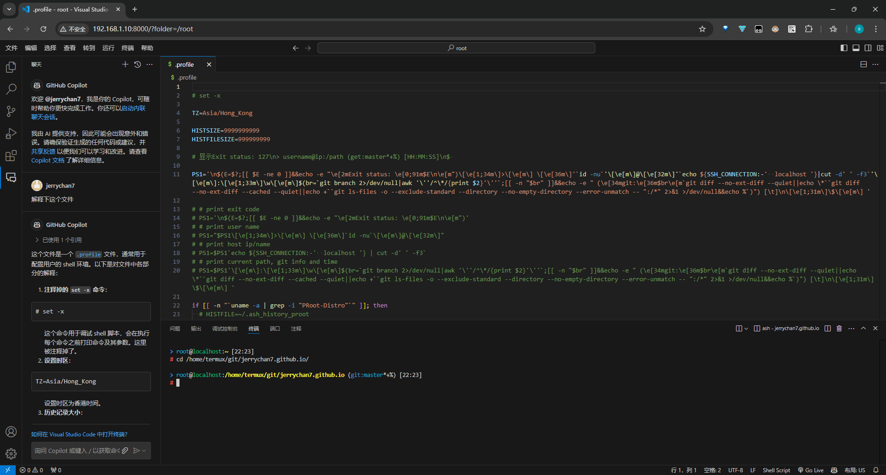
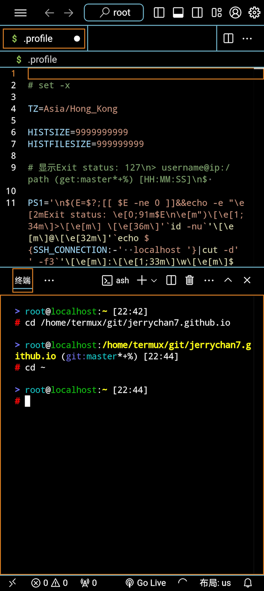

{"tags":["vscode", "android", "折腾"], "abstract": "在 Android 上用 VSCode！"}

# VSCode for Android

本文是讲如何在 Android 上用微软官方的 VSCode！如果你：

* 有个安卓平板（手机也行，但屏幕比较小，体验上并不算好）
* 有个实体键鼠（快捷键啊快捷键，没有也能用，就不太方便）
* 没有电脑又有编程需求
* 或者需要频繁的传源代码到安卓端

那本文简直是为你量身定做的。



> 我一直都有在手机上写代码的习惯。从最开始大约 2014 年，盛行 MineCraft PE 版，我是个 mod 制作者，当时还是 [BlockLauncher (BL)](https://github.com/zhuowei/MCPELauncher) 的天下。  
> 一晃十年过去了，至今还在怀念当年在被窝里拿着手机敲 JavaScript 的日子。后来 es5 出来了，es6 也出来了（但 BL 并不支持），再后来，五年前 BL 都停止更新了。  
> 最复杂的作品是在 MCPE 还没红石的时候，用 js 实现了红石系统。凭着爱好，愣是在完全没接触过数据结构和算法的情况下，自悟了数组和字典的区别，写出了字典优化的广度优先搜索。  
> 扯远了。当年试了很多编辑器，最终找到了 DroidEdit，早就在 15 年就停止了更新的编辑器给了咱很多的惊喜，首先是舒适的高亮，其次是需要的运行资源并不多（当年手机太垃圾）。
>
> 如今，如果你是需要直接在安卓上设备上写代码，那么我后来找到的 [Acode](https://github.com/deadlyjack/Acode) 可能很适合你。  
> 它支持 sftp，代码提示，代码块折叠，同时有强大的插件系统，配合 [Termux][termux]，加入 OpenAI 之类的 AI 辅助提示，体验上可以说是超弱化版的 VSCode。  
> 其实如果你没有大屏幕+键鼠的话其实更推荐上这个，而非本文说的 VSCode。

早些年，解决方案都是指向 [code-server](https://github.com/coder/code-server)，但这个是第三方的，和官方没有啥关系。而且绝大部分插件都用不了，[还需要手动下载并导入](https://coder.com/docs/code-server/FAQ#why-cant-code-server-use-microsofts-extension-marketplace)。  
所以咱们要上就直接上官方的！前几年 VSCode 对于触屏设备几乎没有支持，但随着微软开始重视 [vscode.dev][vsc.dev] 网页的开发，触屏设备逐渐开始有了一定的兼容性 ~~虽然体验上还是很屎~~。
同时，VSCode 逐渐分离了客户端和服务端，这就使很多操作成为了可能。同时出了一个 [VSCode CLI](https://code.visualstudio.com/docs/editor/command-line) 是将所有一切粘合起来的一个入口。

感谢 [Termux][termux]，提供了一个类 Linux 环境，但还是有不小差异的，特别是在文件路径和可执行文件上的差异。
要获得更接近原生的体验，需要 [proot-distro](https://github.com/termux/proot-distro)，其可看作是一个使用 `proot` 的巨型 bash 脚本，打包了其他用户设置好的 Linux 发行版。
本质上来说是提供了一个容器，主要做的是假装你的根目录在 rootfs 的目录下，提供文件级别的隔离，但是进程等共享你当前运行的系统的资源。
接下来，我从头记录如何从零开始配置环境。

## 安装 Termux

首先是安装 [Termux][termux]。目前是推荐在 [GitHub](https://github.com/termux/termux-app/releases)/[F-Droid](https://f-droid.org/en/packages/com.termux/) 中下载安装。
我是从 F-Droid 中安装的，因为 Termux 配套的生态在 F-Droid 中都能找到。
（能在这两个源任意一个下到，都证明会翻墙了，下面的基本都开着梯子吧）  
安装完 Termux 后：

```bash
pkg update
pkg upgrade # 这个过程中会有提示说要不要改 usr/etc/apt/sources.list 里的东西，直接 Y 就可以了，旧的会自动备份到同目录下的 sources.list.dpkg-old
pkg i vim proot-distro openssh
termux-setup-storage # 可选】请求外部储存访问权限
mkdir ~/vscode # 新建个目录放 VSCode 相关的东西
```

VSCode 中有一个 SSH 连接上后就能用的功能，但 VSCode 本身运行是需要 libstdc++.so 和 /lib/ld-musl-aarch64.so.1 之类的库的，Termux 本身是缺失必要的库的，同时库的路径也是不对的。
因此尝试用 VSCode 直接 SSH 上去是不行的。
其实此时解决方案就已经有眉目了，就不是 `proot` 所解决的痛点吗。

在此之前，需要将 VSCode CLI 下载到本地，方便后续操作。
执行 `uname -a` 来获取当前 CPU 架构。根据下表选择运行的代码：

| 架构 | 命令 |
| --- | --- |
| arm64 / aarch64 | `curl -Lk 'https://code.visualstudio.com/sha/download?build=stable&os=cli-alpine-arm64' --output ~/vscode/vscode_cli.tar.gz` |
| arm32 / armv7l / armv8l | `curl -Lk 'https://code.visualstudio.com/sha/download?build=stable&os=cli-linux-armhf' --output ~/vscode/vscode_cli.tar.gz` |
| x64 | `curl -Lk 'https://code.visualstudio.com/sha/download?build=stable&os=cli-alpine-x64' --output ~/vscode/vscode_cli.tar.gz` |

然后到目录里解压文件，目前压缩包里就一个 `code` 可执行文件：

```bash
cd ~/vscode
# 解压
tar -xf vscode_cli.tar.gz
# 新建个文件夹给 VSCode Server 存放用户数据和安装的插件扩展
mkdir -p server/data server/extensions
# 新建个文件夹给 Alpine 下的 CLI 存放下载的 VSCode Server
mkdir -p alpine-cli/cli
# 新建个文件夹给 Ubuntu 下的 CLI 存放下载的 VSCode Server
mkdir -p ubuntu-cli/cli
```

## 安装和配置 alpine

接下来通过 `proot-distro` 来安装 Alpine Linux。  
首选是 Alpine Linux，因为足够小，只有不到 3MB。
除了它之外最小的发行版是 Ubuntu，大约 25MB。
如果用不习惯 Alpine，可以看下面一节 Ubuntu 的。
但一般来说，作为轻度使用，并没有必要上过于复杂的系统，避免过多的资源占用。

```bash
pd i alpine
# 以隔离环境启动 alpine 且进入交互式 shell。剩下的是路径绑定。如果你没有 termux-setup-storage 请求储存访问权限，则没有 /sdcard 那个路径，可删
pd sh alpine --isolated --bind /data/data/com.termux:/termux --bind ~:/home/termux --bind /storage/emulated/0:/sdcard
# 为了方便，你可以在 .bashrc 里 alias alpine='...' 将上面的写个别名
# 同时，proot-distro 虚拟的系统的文件都存在：
# export PDFS=/data/data/com.termux/files/usr/var/lib/proot-distro/installed-rootfs
```

在 Alpine Linux 里：

```bash
apk update
apk upgrade

# 可选】添加说明手册 man
apk add mandoc man-pages
# 可选】将现在系统装有的包有 doc 的都加到 man 里
apk add docs

# 装 nodejs 是为了 VSCode Server 执行依赖环境
apk add nodejs

# 将 VSCode CLI 软连接到用户 bin 中
ln -s /home/termux/vscode/code /usr/local/bin/code
# 将 VSCode CLI 存放数据的文件夹软连接过来（--cli-data-dir 默认是 ~/.vscode/cli）
ln -s /home/termux/vscode/alpine-cli /root/.vscode
# 将 VSCode Server 存放数据的文件夹软连接过来（--server-data-dir 默认是 ~/.vscode-server）
mkdir .vscode-server
ln -s /home/termux/vscode/server/data /root/.vscode-server/data
ln -s /home/termux/vscode/server/extensions /root/.vscode-server/extensions
# 可选】将 CLI 连接到 .vscode-server 里
ln -s /home/termux/vscode/alpine-cli/cli /root/.vscode-server/cli

# 可选】如果需要用 npm 的话 要单独安装 npm
apk add npm

# 可选】安装 git
apk add git

# 可选】调整时区
apk add tzdata
ln -s /usr/share/zoneinfo/Asia/Hong_Kong /etc/localtime
echo -e "\n\nTZ=Asia/Hong_Kong\n" >> ~/.profile
echo -e "\n\nif [ -r ~/.profile ]; then . ~/.profile; fi\n" >> /etc/profile

# 可选】装 ssh
apk add openssh
# 配置 sshd 的秘钥
ssh-keygen -A
# 设置密码，方便以后 SSH
passwd
# 可选】sshd 的调用是要使用绝对路径的，为了方便可以写个别名：
echo -e "\nalias sshd='/usr/sbin/sshd'\n" >> ~/.profile
# 配置 sshd 的默认端口，以及允许root登录
echo -e "\nPort 8023\nPermitRootLogin yes\n" >> /etc/ssh/sshd_config
# 配置允许 VSCode SSH 上去后可以进行端口转发
sed -E 's/(AllowTcpForwarding )no/\1yes #no/' /etc/sshd/sshd_config

# 可选】将宿主机的 authorized_keys 软连接到 Alpine
[ -e "/home/termux/.ssh/authorized_keys" ] && ln -s /home/termux/.ssh/authorized_keys /root/.ssh/authorized_keys
# 可选】将宿主机的私钥复制到 Alpine
cp /home/termux/.ssh/id_ed25519 /root/.ssh/id_ed25519
```

## 安装和配置 Ubuntu

如果你不喜欢 Alpine Linux，那也许你可以尝试下 Ubuntu。
但还是不推荐使用 Ubuntu，因为 `proot-distro` 本身只是对路径和一些常用工具的模拟，本身系统底层还是 Android（没有 `systemctl` 之类的）

```bash
pd i ubuntu
# 以隔离环境启动 ubuntu 且进入交互式 shell。剩下的是路径绑定。如果你没有 termux-setup-storage 请求储存访问权限，则没有 /sdcard 那个路径，可删
pd sh ubuntu --isolated --bind /data/data/com.termux:/termux --bind ~:/home/termux --bind /storage/emulated/0:/sdcard
# 为了方便，你可以在 .bashrc 里 alias ubuntu='...' 将上面的写个别名
# 同时，proot-distro 虚拟的系统的文件都存在：
# export PDFS=/data/data/com.termux/files/usr/var/lib/proot-distro/installed-rootfs
```

在 ubuntu 里：

```bash
# 由于 Android 没有 Systemd，禁用 Ubuntu 的 Snap
cat << EOF | tee /etc/apt/preferences.d/nosnap.pref
# To prevent repository packages from triggering the installation of Snap,
# this file forbids snapd from being installed by APT.
# For more information: https://linuxmint-user-guide.readthedocs.io/en/latest/snap.html
Package: snapd
Pin: release a=*
Pin-Priority: -10
EOF

apt update
apt upgrade

# 可选】说明手册 man
apt install man

# 装 nodejs 是为了 VSCode Server 执行环境
apt install nodejs

# 可选】设置时区
apt install tzdata
# ln -s /usr/share/zoneinfo/Asia/Hong_Kong /etc/localtime

# 可选】安装 ssh
apt install ssh
mkdir /run/sshd
# 配置 sshd 的默认端口，以及允许root登录
echo -e "\nPort 8024\nPermitRootLogin yes\n" >> /etc/ssh/sshd_config
passwd
# 配置允许 VSCode SSH 上去后可以进行端口转发
echo -e "\nAllowTcpForwarding yes\n" >> /etc/ssh/sshd_config
# 可选】将宿主机的 authorized_keys 软连接到 Ubuntu
[ -e "/home/termux/.ssh/authorized_keys" ] && ln -s /home/termux/.ssh/authorized_keys /root/.ssh/authorized_keys
# 可选】将宿主机的私钥复制到 Ubuntu
cp /home/termux/.ssh/id_ed25519 /root/.ssh/id_ed25519

# 可选】如果需要用 npm 的话 要单独安装 npm 这个依赖很多需要挺大的空间的
apt install npm

# 可选】安装 git
apt install git

# 将 VSCode CLI 软连接到用户 bin 中
ln -s /home/termux/vscode/code /usr/local/bin/code
# 将 VSCode CLI 存放数据的文件夹软连接过来（--cli-data-dir 默认是 ~/.vscode/cli）
ln -s /home/termux/vscode/ubuntu-cli /root/.vscode
# 将 VSCode Server 存放数据的文件夹软连接过来（--server-data-dir 默认是 ~/.vscode-server）
mkdir .vscode-server
ln -s /home/termux/vscode/server/data /root/.vscode-server/data
ln -s /home/termux/vscode/server/extensions /root/.vscode-server/extensions
# 可选】将 CLI 连接到 .vscode-server 里
ln -s /home/termux/vscode/ubuntu-cli/cli /root/.vscode-server/cli
```

## VSCode 启动！

上面的设置中，将 VSCode Server 的配置都统一存放到了 `/data/data/com.termux/files/home/vscode/server` 中:

* `data/` 存放的是用户数据，包括配置之类的
* `extensions/` 存放的是下载好的插件
* 上面两个文件夹都以软连接的形式连接到了发行版中
* 好处是脱离了 `proot-distro` 的影响，发行版随便切换折腾都不会影响你设置好的 VSCode 配置
* 同时，VSCode 客户端 SSH 连接上去后，数据也是存放到这两个文件夹中的，保证一致的体验

是的，如果你配置了 SSH，这个时候其实就能系统中开启 sshd，用 VSCode SSH 上去开始爽了。

虽然可以用，但是 SSH 上去其实是比较吃资源的（尝试多打开几个文件夹然后 `ps -e` 一下就知道了）。
而且这不是在安卓上使用 VSCode。

重点来了，如果你是在本地/局域网内，可以直接通过命令启动 VSCode Web Server 来在网页上体验 VSCode！

```bash
code serve-web --host '0.0.0.0' --without-connection-token
```

> 如果出现 `uv_interface_addresses` 错误不影响正常使用，这是可能是由于 Android 不允许直接获得硬件 Mac 地址导致的。更多可以查看 [termux/issues#10868](https://github.com/termux/termux-packages/issues/10868)。

如果你是在远程，可以通过 Remote Tunnels 来连接！只需要执行命令，并且打开 [vscode.dev][vsc.dev] 登录就可以了！没有麻烦的内网穿透，没有麻烦的 VPS！一切都这么简单！

```bash
code tunnel
```

如果你是 Alpine，ash 需要手动添加 `-l` 参数，配置使用交互式shell（登录时调用 `/etc/profile` 文件），VSCode 配置：

```json5
{
    "terminal.integrated.defaultProfile.linux": "ash",
    "terminal.integrated.profiles.linux": {
        "ash": {
            "path": "/bin/ash",
            "icon": "terminal",
            "args": [
                "-l"
            ]
        }
    },
}
```

推荐配置写到远程服务器上，Ubuntu 中没有 ash，所以默认打开不会是 ash，而是 bash。

> ash 美化可以看咱上一篇文章[《bash / ash 美化》](../bash、ash%20美化/bash、ash%20美化.html)。
> 如果你选择在 alpine 里装 bash，你可能发现咱的美化在时间上是有问题的，原因是因为 busybox 的 data 命令和 Ubuntu 环境的是不一样的，需要 `apk add coreutils`。

## 已知问题和限制

1. 局域网内的设备由于不是 `https` 协议，因此像 markdown 预览功能啊、复制粘贴啊可能是没办法正常用的。后续有时间我看看能不能局域网搞个签名，然后配置 nginx 端口转发，最后可能会出个教程，或者有人有精力折腾的可以一试。但是本机的 `localhost` 和 `127.0.0.1` 不受影响。
2. 有极小一部分插件是不能用的，目前就发现微软官方的 Remote - SSH 是装不了的，这就意味着你无法在 Web 版的 VSCode 里再 SSH 远程连接到其他系统了。
3. 外置储存设备里的（`/sdcard`、`/storage/emulated/0`、`/storage/self/primary`），由于 Android 系统本身的限制，无法在上面创建任何软/硬连接。因此 npm 之类的命令，需要依赖软连接的是注定失败的。
4. 由于将 SSH 和 `serve-web` 的 `--server-data-dir` 放到了一块，因此请确保 code 的版本，和 SSH 上去的 VSCode 版本是否是一致的，你可以通过 `code update` 来将 VSCode CLI 更新到最新。
5. 虽然和 VSCode 没关系，但顺带说下 docker 是没办法的，因为 Android 系统底层在编译的时候就缺少 docker 运行必备的某些组件，例如 `iptables` 防火墙。因此需要运行 docker 只能通过采用 QEMU 之类的虚拟机来实现。
6. 如果你没有实体键盘，用的是屏幕虚拟键盘：
   * 在工作区输入失去焦点后，你可能需要点击下周围的一些内容（比如菜单啊之类的区域），然后再点击工作区才能再次唤出键盘。
   * 如果你的焦点是在工作区，且你的菜单是折叠状态的，那么你点击展开菜单图标时菜单可能是一闪而过的，此时你需要点击下除了工作区之外的地方让工作区失去焦点才能正常点击菜单展开按钮。
7. VSCode 的设置界面没有做过小的屏幕的自适应，因此可能需要横屏才能显示全设置内容。
8. 菜单类型，如果你想拥有像桌面版 VSCode 一样的菜单，需要在：设置 > 用户 > 窗口 > Menu Bar Visibility (`window.menuBarVisibility`) 中调成 `classic`/`visible`。但有一个 bug，如果是从 `compact` 状态切换过去的，会失效，因此需要调成其他的再调回你想要的。例如，你现在是 `compact`，想切换成 `visible`，你可能得先换到 `hidden` 再换成 `visible`。

## 在小屏幕上一些有用的设置

如果你非常的具有折腾精神的想要在小屏幕上使用网页版的 VSCode，那么还是需要在 VSCode 上进行些设置，用起来才不那么变扭。下面是我个人的配置，可以作为参考。
首先，你需要将系统的自动旋转屏幕打开，因为设置界面需要横屏才能显示完整。

设置 > 用户：

```json5
{
  // 在主边栏和辅助边栏上方显示活动栏
  "workbench.activityBar.location": "top",
  // 菜单栏可见性，在过小的屏幕上会显示为折叠按钮
  "window.menuBarVisibility": "visible",
  // 关闭缩略图
  "editor.minimap.enabled": false,
  // 调小显示字体
  "editor.fontSize": 12,
  "terminal.integrated.fontSize": 12,
  // 关闭屏幕阅读器支持【理论上会快一些
  "editor.accessibilitySupport": "off",
  // 在视区宽度和“Editor: Word Wrap Column”中的较小值处换行
  "editor.wordWrap": "bounded",
  // 关闭垂直自行边距（常用于debuger）
  "editor.glyphMargin": false,
  // 关闭行号显示
  // "editor.lineNumbers": "off",
  // 行号宽度最小化（https://stackoverflow.com/questions/44912058/is-there-a-way-to-make-vscode-line-number-field-smaller-width）
  "editor.lineDecorationsWidth": 0,
  // 关闭代码折叠功能
  // "editor.folding": false,
  // 高对比度的暗色主题（OLED 屏友好）
  "workbench.preferredDarkColorTheme": "Default High Contrast",
}
```

设置后，可用来显示代码的空间会多很多。



## 中途遇到的坑

如果你查看 `code help` 你会发现有一个参数是 `--cli-data-dir`。这个目录存放下载下来的 VSCode Server 本身。
本来想着 Alpine 和 Ubuntu 设置成一样能共用的，可以避免重复下载和更新。
结果忽略了它下载下来的 node 是和系统强相关的，Alpine 和 Ubuntu 的动态连接器是完全不一样的，导致了无法通用……

这是 Alpine 下 VSCode CLI 下载下来的：

```txt
> file alpine/vscode/cli/serve-web/hash/node
alpine/vscode/cli/serve-web/hash/node: ELF 64-bit LSB pie executable, ARM aarch64, version 1 (SYSV), dynamically linked, interpreter /lib/ld-musl-aarch64.so.1, with debug_info, not stripped
```

这是 Ubuntu 下 VSCode CLI 下载下来的：

```txt
> file ubuntu/vscode/cli/serve-web/hash/node
ubuntu/vscode/cli/serve-web/hash/node: ELF 64-bit LSB executable, ARM aarch64, version 1 (GNU/Linux), dynamically linked, interpreter /lib/ld-linux-aarch64.so.1, BuildID[sha1]=ac53c694372490a52ad5071f1560feaad4924021, for GNU/Linux 3.7.0, with debug_info, not stripped, too many notes (256)
```

可以看到一个用的是 `/lib/ld-musl-aarch64.so.1`，一个用的是 `/lib/ld-linux-aarch64.so.1`。必然不能共用，musl 和 glibc 完全就是两个东西……

因此，就算其他的东西都一样，但还是得区分两者的 CLI 路径。


[termux]: https://termux.dev/en
[vsc.dev]: https://vscode.dev
