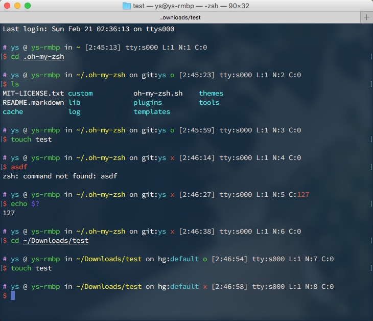

{"tags":["linux", "bash", "ash"]}

# bash、ash 美化

我在过去相当长一段时间都喜欢使用 zsh。
但接触到更多的东西后，我又选择回到了 bash，其支持更为广泛，且足够简单易懂，很多编写的脚本也都是基于 bash 的。
归根到底，扪心自问，我用 zsh 并不是因为 zsh 有什么特别的功能，而是喜欢 oh-my-zsh 中大量的主题。

那么只是外观的话，为何不直接让 bash 长得顺眼点？那我就基本可以放弃 zsh 了。说干就干！

先来点最终效果图：

win11 terminal 中的表现：  


vscode terminal 中的表现：  


putty 中的表现：  


alpine 的 ash 中的表现：  


## 思路过程

我平常挺喜欢 [oh-my-zsh 的 ys 主题](https://github.com/ohmyzsh/ohmyzsh/wiki/Themes#ys)，因为只使用了 ANSI 字符集和 ANSI 颜色，在各个环境中都比较适应（如果折腾过嵌入式/termux/跨平台之类的，就知道特殊字符有多难搞）。我会以这个目标努力。

ys 主题大致上是这个模式：

```txt
PRIVILEGES USER @ MACHINE in DIRECTORY on git:BRANCH STATE [HH:MM:SS] L:SHELL_LEVEL N:LINE_NUM C:EXIT_CODE
$ COMMAND
```

> 第一个字符 `%`/`#`（root模式）作为特权状态提示符。这是 zsh 自带的能力。`L` 表示当前 shell 级别，当您处于嵌套 shell 中时，它会很有用。最后的 `N` 表示当前命令编号。但这两个好像在现在的实现里已经没有了，基本没见到过。

显示：



这个还是比较好实现的。bash 中通过 `PS1` 变量来实现提示。也有通过 `PROMPT_COMMAND` 来实现的，但我所需要做的是一切从简，能获得更多的兼容性。例如 ash 就没有 `PROMPT_COMMAND` 变量。

我不喜欢第一个字符是特权状态提示符，更适应在命令之前的主命令提示符来作为特权提示符，和 bash 默认的行为一致。因为你可能会忽略作为提示信息的行，但你输入命令前的字符你是基本都会注意到的。因此我第一个字符将会固定为`>`。

其次，我会在手机等小屏幕设备访问，因此不希望过长的提示，所以我会将所有的空格都去掉，就以颜色来区分。需要保持更多专注度的将会用更醒目的颜色来进行提醒。

因此，最终的模式可能是这样子的：

```txt
Execution time: 0.003s
Exit status: EXIT_CODE
> username@IpOrHost:/path (git:branch*+) [HH:MM:SS]
$ COMMAND
```

## 实现

眼熟？没错，前半段是 `scp` 命令的风格。后半段参考 ys 主题弄的。鉴于 `L`/`N` 作用较少，去掉。`C` 提示上条命令的返回码，还是需要的。
鉴于垂直空间较多，位置换一下，放到上一行去，非零时再显示。
执行时间方便对命令执行时长做直观展示。本来想做根据时长动态显示时分秒的，但貌似很复杂就放弃了。

那么 `PS1` 基本就长这样：

```bash
PS1="Execution time: ...s\n"
PS1=$PS1"Exit status: $?\n"
PS1=$PS1"> `id -nu`@`hostname`:\w (git:BRANCH*+%) [\t]\n"
PS1=$PS1"\$ "
```

### 服务器IP显示部分

先从简单的开始，由于经常使用 ssh 连接到远程机器，因此希望 `hostname` 部分在远程的时候是显示 IP，本地机器的时候是显示 `localhost`，而 `hostname` 命令并不能办到。因此需要想个法子。基本上我连接的环境都是使用 OpenSSH 的，用 dropbear 的几乎没有。而 [OpenSSH 在连接成功后会设置一个环境变量 `SSH_CONNECTION`](https://linux.die.net/man/1/ssh)，该变量由 `客户端IP 客户端端口 服务器IP 服务器端口` 四个部分组成，中间用一个空格隔开。那么可以简单的通过 shell 参数扩展和 `cut` 命令来达成目的：

```bash
echo ${SSH_CONNECTION:-'  localhost'}|cut -d' ' -f3
```

在变量 `SSH_CONNECTION` 未定义或为空时，将会使用字符串 `  localhost`，然后使用 `cut` 命令，以空格作为分割（`-d' '`），选取第三个（`-f3`），这样就可以在本机的时候显示 `localhost` 而在 ssh 远程的时候显示服务器 IP 了。

### 返回码部分

然后是返回码部分。希望办到非 0 时显示。根据[一些前人经验](https://stackoverflow.com/questions/5946873/include-non-0-exit-codes-in-the-subsequent-bash-prompt)，借助 `$()` 和 ``` `` ``` [是在子 shell 中执行](https://www.gnu.org/software/bash/manual/html_node/Command-Substitution.html)，里面的临时变量不会影响到现在外面的，可以这样达成目的：

```bash
$(E=$?;[[ $E -ne 0 ]]&&echo -e "Exit status: $E\n\e[m")
```

一个小技巧，由于子shell的输出最后的换行符会被删除，因此需要在最后添加个颜色符号来避免换行符被删除。

### git 信息显示部分

git部分希望显示当前的分支名，工作区有未暂存的改动在后面显示个 `*`，暂存区有内容后面显示个 `+`，工作区有未跟踪的在后面显示个 `%`。
感谢上天，[`ohmyzsh/git.zsh`](https://github.com/ohmyzsh/ohmyzsh/blob/master/lib/git.zsh) 和 [`git_bash/git-prompt.sh`](https://github.com/git/git/blob/master/contrib/completion/git-prompt.sh) 给了足够多的提示。我所希望的功能足够简单，因此并不需要非常复杂的东西：

```bash
function __git_prompt_info() {
  local e=$?
  local br=`git branch 2>/dev/null | awk '/^\*/{print $2}'`
  if [[ -n "$br" ]]; then
    br=" (git:$br"
    br=$br`git diff --no-ext-diff --quiet || echo "*"`
    br=$br`git diff --no-ext-diff --cached --quiet || echo "+"`
    br=$br`git ls-files --others --exclude-standard --directory --no-empty-directory --error-unmatch -- ':/*' >/dev/null 2>/dev/null && echo "%"`
    br=$br")"
    echo -e "$br"
  fi
  return $e
}
```

这个方法最妙的是，就算没有装 `git` 命令也能正常跑，而且不需要通过复杂的方式来判断是否在 git 仓库里。此外，这个函数足够简单，因此借助子 shell 隔绝局部变量影响，甚至可以写到一行里 ~~（虽然有点长）~~：

```bash
$(br=`git branch 2>/dev/null|awk '/^\*/{print $2}'`;[[ -n "$br" ]]&&echo -e " (git:$br`git diff --no-ext-diff --quiet||echo \*``git diff --no-ext-diff --cached --quiet||echo +``git ls-files -o --exclude-standard --directory --no-empty-directory --error-unmatch -- ":/*" 2>&1 >/dev/null&&echo %`)")
```

### 执行时间部分

根据[前人经验](https://stackoverflow.com/questions/43201274/use-ps0-and-ps1-to-display-execution-time-of-each-bash-command)，在 bash 版本在 4.4 以上，可以借助 `PS0` 和 `PROMPT_COMMAND` 变量，还会有个全局变量`__t`来记录时间。

```bash
PS0='${__t:0:$((__t=$(date +%s%N),0))}'
PROMPT_COMMAND='(( __t ))&&printf "\n\e[2mExecution time: %d.%09ds\e[m" $((__t=$(date +%s%N)-__t,__t/1000000000)) $((__t%1000000000));__t=0'
```

如果有人有更好的方法欢迎留言。

### 整合

整合上面说的内容，再加入一点点颜色魔法：

```bash
PS0='${__t:0:$((__t=$(date +%s%N),0))}'
PROMPT_COMMAND='(( __t ))&&printf "\n\e[2mExecution time: %d.%09ds\e[m" $((__t=$(date +%s%N)-__t,__t/1000000000)) $((__t%1000000000));__t=0'
PS1='\n$(E=$?;[[ $E -ne 0 ]]&&echo -e "\e[2mExit status: \e[0;91m$E\n\e[m")\[\e[1;34m\]>\[\e[m\] \[\e[36m\]'`id -nu`'\[\e[m\]@\[\e[32m\]'`echo ${SSH_CONNECTION:-'  localhost'}|cut -d' ' -f3`'\[\e[m\]:\[\e[1;33m\]\w\[\e[m\]$(br=`git branch 2>/dev/null|awk '\''/^\*/{print $2}'\''`;[[ -n "$br" ]]&&echo -e " (\e[34mgit:\e[36m$br\e[m`git diff --no-ext-diff --quiet||echo \*``git diff --no-ext-diff --cached --quiet||echo +``git ls-files -o --exclude-standard --directory --no-empty-directory --error-unmatch -- ":/*" >/dev/null 2>&1&&echo %`)") [\t]\n\[\e[1;31m\]\$\[\e[m\] '
```

小技巧，`\e[m` 可以直接将颜色重置，而不用写比较长的 `\e[0;0m` 之类的。

由于采用了比较标准的写法，这个在 bash 和 alpine 的 ash 里都适用。但由于 ash 没有 `PS0` 和 `PROMPT_COMMAND`，因此显示不出来执行时间相关的内容。但可以一起用同一个 `.profile`。

另一方面，由于 ash 是由 busybox 实现的，因此很多和 bash 还是不一样的，比如 date。因此在 ash 中时间是按 `[HH:MM]` 的形式出现的。虽然说可以改成 `date` 命令，但最终还是懒了。

## 其他

虽然不是很应该出现在 《bash/ash美化》 这一篇，但找不到地方放了。反正和基本都和 `.bashrc` 相关，就顺手在这里写了。

由于我经常性的忘记东西，因此很多情况下是严重依赖 `history` 的，而 bash 默认的逻辑中，历史只有终端正常 `exit` 后才会进行写入，这就导致丢失了很多的历史记录。目前是开启了无限的记录；记录所有详细时间戳；为了避免过于夸张的历史体积，同时也为了便于查找，擦除重复的命令；将历史记录都添加到历史文件末尾。

根据[这个](https://superuser.com/questions/137438/how-to-unlimited-bash-shell-history)，和[这个](https://cloud.tencent.com/developer/article/1889209)，得出：

```bash
# 无限的记录
HISTSIZE=
# 无限的历史记录文件大小
HISTFILESIZE=
# 避免过于夸张的历史体积，同时也为了便于查找，擦除重复的命令
HISTCONTROL=ignoreboth:erasedups
# 记录所有详细时间戳 %F=year-month-date %T=hour:minute:seconds
HISTTIMEFORMAT="[%F %T] "
# When the shell exits, append to the history file instead of overwriting it
shopt -s histappend
# -a 将命令追加到历史文件  -c 情况会话中的历史  -r 将历史文件内容作为当前历史
PROMPT_COMMAND='history -a; history -c; history -r;'
```
